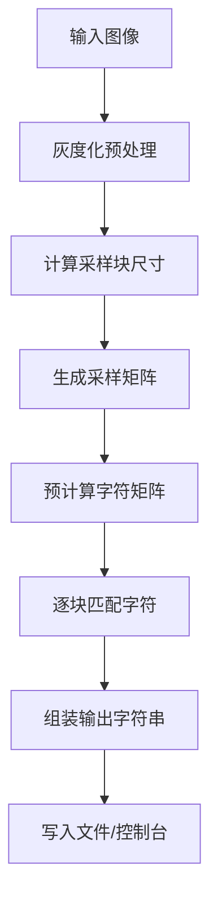

#  图片转字符画算法详解

## 📊 流程概览



---

## 🔍 详细步骤

### 1. 图像预处理 (灰度化)

**输入**: RGB/BGR 图像 (H × W × 3)  
**输出**: 灰度图像 (H × W)

**实现**:
```python
# OpenCV BGR → Grayscale
gray = cv2.cvtColor(image, cv2.COLOR_BGR2GRAY)
```

**数学原理**:
- 使用加权平均: `Gray = 0.299*R + 0.587*G + 0.114*B`
- OpenCV 内部已优化，直接调用即可

---

### 2. 计算采样块尺寸

**目标**: 根据源图像尺寸和期望输出尺寸，计算每个采样块的大小

**公式**:
```python
# 情况 1: 同时指定高度和宽度
rectsize_h = ceil(source_height / output_height)
rectsize_w = ceil(source_width / (output_width * vertical_horizontal_ratio))

# 情况 2: 只指定高度
rectsize_h = ceil(source_height / output_height)
rectsize_w = round(rectsize_h / vertical_horizontal_ratio)

# 情况 3: 只指定宽度
rectsize_w = ceil(source_width / (output_width * vertical_horizontal_ratio))
rectsize_h = round(rectsize_w * vertical_horizontal_ratio)

# 边界保护 (避免除以零)
rectsize_h = max(2, rectsize_h)
rectsize_w = max(1, rectsize_w)
```

**关键参数**:
- `vertical_horizontal_ratio`: 垂直水平比例，通常为 2.0 (字体高度约为宽度的 2 倍)
- **边界保护**: `rectsize_h >= 2`, `rectsize_w >= 1`，防止小图像大输出时的除以零错误

**时间复杂度**: O(1)

---

### 3. 生成采样矩阵

**目标**: 将源图像划分为多个矩形块，对每个块进行缩放和归一化

**流程**:
```
for y in range(0, source_height, rectsize_h):
    for x in range(0, source_width, rectsize_w):
        # 提取当前块
        block = image[y:y+rectsize_h, x:x+rectsize_w]
        
        # 填充到固定大小 (不足部分用白色填充)
        padded_block = pad_to_size(block, rectsize_h, rectsize_w)
        
        # 缩放到 matrix_size × matrix_size
        resized = cv2.resize(padded_block, (matrix_size, matrix_size), 
                            interpolation=cv2.INTER_CUBIC)
        
        # 归一化到 [0, 1]
        normalized = resized / 255.0
        
        # 存储到采样数组
        sampling_array[y_index, x_index] = normalized
```

**关键细节**:
- **插值算法**: 默认使用 `INTER_CUBIC` (可通过 `--interpolation` 配置)
- **归一化**: 像素值从 [0, 255] 映射到 [0, 1]
- **填充策略**: 不足部分用白色 (255) 填充，保持块尺寸一致

**时间复杂度**: O(H × W)  
**空间复杂度**: O(output_height × output_width × matrix_size²)

---

### 4. 预计算字符矩阵

**目标**: 为字符集中的每个字符生成对应的灰度矩阵

**流程**:
```python
for char in charset:
    # 创建空白画布
    canvas = Image.new('L', (canvas_width, matrix_size), 255)
    
    # 绘制字符
    draw.text((0, 0), char, font=font, fill=0)
    
    # 转换为数组并缩放
    matrix = cv2.resize(np.array(canvas), target_size) / 255.0
    
    # 存储到字符数据列表
    char_data.append({'character': char, 'matrix': matrix})
```

**关键参数**:
- `matrix_size`: 单个字符的归一化尺寸 (默认 5)
- `target_size`: 
  - 普通字符: `(matrix_size, matrix_size)`
  - 宽字符: `(2 × matrix_size, matrix_size)`

**时间复杂度**: O(C × M²)，其中 C = 字符集大小，M = matrix_size  
**空间复杂度**: O(C × M²)

---

### 5. 逐块匹配字符

**目标**: 对每个采样块，找到最匹配的字符

**匹配算法**: 绝对差值之和 (Sum of Absolute Differences, SAD)

**公式**:
```python
def calculate_match_score(sampling_block, char_matrix):
    # 计算绝对差值之和
    diff = np.abs(sampling_block - char_matrix)
    score = np.sum(diff)
    return score
```

**匹配策略**:
```python
# 1. 查找最佳普通字符
normal_indice, normal_score = find_best_normal_char(rectangle, char_data)

# 2. 查找最佳宽字符 (合并当前块和下一块)
wide_indice, wide_score = find_best_wide_char(rectangle, next_rectangle, wide_data)

# 3. 决定使用哪种字符
if wide_score < wide_sum_ratio * normal_score:
    use_wide = True  # 使用宽字符，跳过下一个块
else:
    use_wide = False  # 使用普通字符
```

**关键参数**:
- `wide_sum_ratio`: 宽字符权重比例 (默认 2.0)
  - 含义: 宽字符得分需要比普通字符小此倍数才优先使用
  - 调整建议: 根据字体特性微调 (1.5 ~ 3.0)

**时间复杂度**: O(R × C × M²)，其中 R = 采样块数量，C = 字符集大小  
**空间复杂度**: O(1) (原地计算)

---

### 6. 组装输出字符串

**流程**:
```python
final_output = ''
skip_sign = False  # 跳过标识 (宽字符占用两个位置)

for index, row in enumerate(sampling_array):
    for i, rectangle in enumerate(row):
        if skip_sign:
            skip_sign = False
            continue
        
        # 匹配字符...
        
        if use_wide:
            final_output += wide_char
            skip_sign = True  # 标记跳过下一个块
        else:
            final_output += normal_char
    
    # 添加换行符 (最后一行除外)
    if index != len(sampling_array) - 1:
        final_output += '\n'
```

**关键细节**:
- **宽字符处理**: 使用宽字符时设置 `skip_sign = True`，跳过下一个采样块
- **行末尾处理**: 最后一行不添加换行符

---

## 📈 复杂度分析

### 时间复杂度

| 阶段 | 复杂度 | 说明 |
|------|--------|------|
| 图像预处理 | O(H × W) | 灰度化 |
| 计算采样块尺寸 | O(1) | 简单算术运算 |
| 生成采样矩阵 | O(H × W) | 遍历所有像素 |
| 预计算字符矩阵 | O(C × M²) | C = 字符集大小 |
| 逐块匹配字符 | O(R × C × M²) | R = 采样块数量 |
| 组装输出 | O(R) | 线性遍历 |
| **总计** | **O(H × W + R × C × M²)** | 主导项为匹配阶段 |

**实际性能** (典型场景):
- 输入: 500×500 图像
- 输出: 50×50 字符画
- 字符集: 95 个 ASCII 字符
- matrix_size: 5
- **耗时**: ~0.5-2 秒 (取决于硬件)

### 空间复杂度

| 数据结构 | 大小 | 说明 |
|----------|------|------|
| 灰度图像 | H × W | 原始图像 |
| 采样数组 | R × M² | R = output_height × output_width |
| 字符矩阵 | C × M² | C = 字符集大小 |
| 输出字符串 | R | 最终结果 |
| **总计** | **O(H × W + R × M² + C × M²)** | 主导项为原始图像 |

**内存优化建议**:
- 使用 `np.float32` 而非 `np.float64` (节省 50% 内存)
- 及时释放中间变量 (`del` 或作用域结束自动回收)
- 对于超大图像，考虑分块处理

---

## 🔧 JS 实现要点

### NumPy → JavaScript 转换

| Python (NumPy) | JavaScript | 注意事项 |
|----------------|------------|----------|
| `np.abs(a - b)` | 循环计算 | JS 无内置向量化操作 |
| `np.sum(array)` | `array.reduce((a,b) => a+b, 0)` | 手动累加 |
| `cv2.resize()` | Canvas API `drawImage()` | 使用 `<canvas>` 元素 |
| `np.hstack((a, b))` | 数组合并 | 手动拼接二维数组 |
| `np.ones(shape)` | `Array.from({length: h}, () => Array(w).fill(1))` | 嵌套数组初始化 |

### 性能优化建议

1. **避免频繁创建数组**: 复用缓冲区
2. **使用 TypedArray**: `Float32Array` 比 `Array<number>` 更快
3. **Web Workers**: 将匹配计算移至后台线程
4. **Canvas 离屏渲染**: 预计算字符矩阵时使用离屏 Canvas

### 精度差异注意

- **浮点精度**: JS `Number` (IEEE 754 double) vs Python `float64`
- **舍入误差**: `Math.round()` vs `round()` 行为一致
- **整数除法**: JS `/` 始终返回浮点数，需手动 `Math.floor()`

---

## ️ 常见变体和优化

### 1. 并行化匹配

**思路**: 每个采样块的匹配独立，可并行计算

**Python 实现**:
```python
from concurrent.futures import ThreadPoolExecutor

def match_block(args):
    rectangle, char_data, wide_data = args
    # 匹配逻辑...
    return matched_char

with ThreadPoolExecutor() as executor:
    results = executor.map(match_block, all_blocks)
```

**JS 实现**:
```javascript
// 使用 Web Workers
const worker = new Worker('matcher-worker.js');
worker.postMessage({ blocks: samplingArray });
worker.onmessage = (e) => { /* 接收结果 */ };
```

### 2. 缓存优化

**思路**: 预计算字符矩阵的统计特征 (均值、方差)，快速筛选候选字符

**实现**:
```python
# 预计算阶段
for char in charset:
    matrix = render_char(char)
    mean = np.mean(matrix)
    variance = np.var(matrix)
    char_cache[char] = {'matrix': matrix, 'mean': mean, 'var': variance}

# 匹配阶段
block_mean = np.mean(rectangle)
candidates = [c for c in char_cache if abs(c['mean'] - block_mean) < threshold]
# 只在候选集中精确匹配
```

### 3. GPU 加速

**思路**: 使用 CUDA/OpenCL 加速矩阵运算

**工具**:
- Python: `cupy` (NumPy GPU 版本)
- JS: WebGL / WebGPU

---

## 📚 参考文献

1. **ASCII Art Generation**: https://en.wikipedia.org/wiki/ASCII_art
2. **Image Sampling Techniques**: Gonzalez & Woods, "Digital Image Processing"
3. **Character Recognition**: Pattern Recognition and Machine Learning (Bishop)

---

*最后更新: 2026-06-08*
