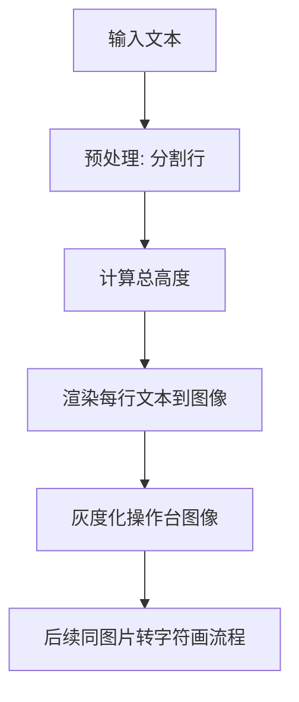

#  文本转字符画算法详解

## 📊 流程概览



---

## 🔍 详细步骤

### 1. 文本预处理

**目标**: 将输入文本转换为行列表

**实现**:
```python
def preprocess_text_input(text_string):
    """
    预处理文本输入
    
    Args:
        text_string: 输入文本 (可能包含 @filename.txt 语法)
    
    Returns:
        list[str]: 文本行列表
    """
    # 处理 @filename.txt 语法
    if text_string.startswith('@'):
        filename = text_string[1:]
        with open(filename, 'r', encoding='utf-8') as f:
            text_string = f.read()
    
    # 按换行符分割
    lines = text_string.split('\n')
    return lines
```

**支持特性**:
- **文件读取**: `@filename.txt` 从文件读取文本
- **多行文本**: `\n` 分隔的多行
- **空行处理**: 保留空行 (用于间距控制)

---

### 2. 计算总高度

**两种模式**:

#### Line 模式 (默认)
- `--height`: 每行字符画的高度 (不包括行间距)
- **总高度**: `height × num_lines + line_spacing × (num_lines - 1)`
- **字体大小**: 始终基于 `height` 参数，不受行间距影响

#### Total 模式
- `--height`: 整体字符画的总高度
- **每行高度**: `(total_height - line_spacing × (num_lines - 1)) / num_lines`
- **字体大小**: 动态调整以适应总高度

**公式**:
```python
if height_mode == 'line':
    # Line 模式: 每行高度固定
    total_height = height * num_lines + line_spacing * (num_lines - 1)
elif height_mode == 'total':
    # Total 模式: 总高度固定
    total_height = height
    per_line_height = (height - line_spacing * (num_lines - 1)) // num_lines
```

**关键细节**:
- **Line 模式陷阱**: 不要从字体可用高度中扣除行间距
- **Total 模式优势**: 精确控制最终输出尺寸

---

### 3. 渲染每行文本到图像

**目标**: 使用 Pillow 将文本渲染为图像

**实现**:
```python
def render_text_to_image(lines, font_path, font_size, text_align, line_spacing):
    """
    渲染文本到图像
    
    Args:
        lines: 文本行列表
        font_path: 字体文件路径
        font_size: 字体大小
        text_align: 对齐方式 ('left', 'center', 'right')
        line_spacing: 行间距 (像素)
    
    Returns:
        Image.Image: 渲染后的图像
    """
    # 加载字体
    font = ImageFont.truetype(font_path, font_size)
    
    # 计算每行尺寸
    max_width = 0
    line_heights = []
    for line in lines:
        bbox = font.getbbox(line)
        width = bbox[2] - bbox[0]
        height = bbox[3] - bbox[1]
        max_width = max(max_width, width)
        line_heights.append(height)
    
    # 计算总尺寸
    total_height = sum(line_heights) + line_spacing * (len(lines) - 1)
    total_width = max_width
    
    # 创建空白图像
    image = Image.new('L', (total_width, total_height), 255)
    draw = ImageDraw.Draw(image)
    
    # 逐行绘制
    y_offset = 0
    for i, line in enumerate(lines):
        # 计算 x 坐标 (对齐)
        bbox = font.getbbox(line)
        line_width = bbox[2] - bbox[0]
        
        if text_align == 'left':
            x_offset = 0
        elif text_align == 'center':
            x_offset = (total_width - line_width) // 2
        elif text_align == 'right':
            x_offset = total_width - line_width
        
        # 绘制文本
        draw.text((x_offset, y_offset), line, font=font, fill=0)
        
        # 更新 y 偏移
        y_offset += line_heights[i] + line_spacing
    
    return image
```

**关键参数**:
- `text_align`: 对齐方式 (`'left'`, `'center'`, `'right'`)
- `line_spacing`: 行间距 (像素)，默认为 0
- `font_reduce`: 字体边缘预留空白 (避免过于接近边缘)

---

### 4. 灰度化操作台图像

**说明**: 此步骤与图片转字符画相同，参考 [image-to-art.md](image-to-art.md)

**注意**: 文本渲染后已经是灰度图像 (mode='L')，无需再次转换

---

##  复杂度分析

### 时间复杂度

| 阶段 | 复杂度 | 说明 |
|------|--------|------|
| 文本预处理 | O(L) | L = 文本长度 |
| 计算总高度 | O(N) | N = 行数 |
| 渲染文本 | O(N × W_avg) | W_avg = 平均行宽 |
| 后续处理 | 同图片转字符画 | - |
| **总计** | **O(L + N × W_avg)** | 主导项为渲染阶段 |

### 空间复杂度

| 数据结构 | 大小 | 说明 |
|----------|------|------|
| 文本行列表 | O(L) | 原始文本 |
| 操作台图像 | W_total × H_total | 渲染结果 |
| 后续处理 | 同图片转字符画 | - |

---

## 🔧 JS 实现要点

### Pillow → JavaScript 转换

| Python (Pillow) | JavaScript | 注意事项 |
|-----------------|------------|----------|
| `ImageFont.truetype()` | Canvas `font` 属性 | 需预加载字体文件 |
| `draw.text()` | Canvas `fillText()` | 坐标系原点不同 |
| `font.getbbox()` | Canvas `measureText()` | 返回宽度，高度需估算 |
| `Image.new('L', ...)` | Canvas `createImageData()` | 手动填充像素数据 |

### 字体加载策略

**JS 实现**:
```javascript
// 方法 1: CSS @font-face
const style = document.createElement('style');
style.textContent = `
  @font-face {
    font-family: 'CustomFont';
    src: url('path/to/font.ttf') format('truetype');
  }
`;
document.head.appendChild(style);

// 方法 2: Font Loading API
const font = new FontFace('CustomFont', 'url(path/to/font.ttf)');
await font.load();
document.fonts.add(font);

// 使用
ctx.font = '20px CustomFont';
ctx.fillText('Hello', x, y);
```

### 文本测量精度

**问题**: Canvas `measureText()` 只返回宽度，不返回高度

**解决方案**:
```javascript
function measureText(ctx, text, fontSize) {
  const width = ctx.measureText(text).width;
  // 高度估算: 通常为 fontSize 的 0.8-1.2 倍
  const height = fontSize * 1.0;  // 简化估算
  return { width, height };
}
```

**更精确的方法**: 使用临时 Canvas 渲染并扫描像素边界

---

## ️ 常见变体和优化

### 1. 富文本支持

**扩展**: 支持不同字体、颜色、大小的混合文本

**实现思路**:
- 解析 Markdown/HTML 格式
- 逐段渲染，记录位置偏移
- 合并到同一画布

### 2. 自动换行

**需求**: 长文本自动折行

**实现**:
```python
def wrap_text(text, max_width, font):
    """自动换行"""
    words = text.split()
    lines = []
    current_line = []
    
    for word in words:
        test_line = ' '.join(current_line + [word])
        bbox = font.getbbox(test_line)
        if bbox[2] <= max_width:
            current_line.append(word)
        else:
            lines.append(' '.join(current_line))
            current_line = [word]
    
    if current_line:
        lines.append(' '.join(current_line))
    
    return lines
```

### 3. 垂直居中/底部对齐

**扩展**: 除了左/中/右对齐，支持垂直方向对齐

**实现**: 计算总高度后，调整 y_offset 起始位置

---

## 📚 相关资源

- [Pillow 文档](https://pillow.readthedocs.io/)
- [Canvas API 文档](https://developer.mozilla.org/en-US/docs/Web/API/Canvas_API)
- [Font Loading API](https://developer.mozilla.org/en-US/docs/Web/API/CSS_Font_Loading_API)

---

*最后更新: 2026-06-08*
