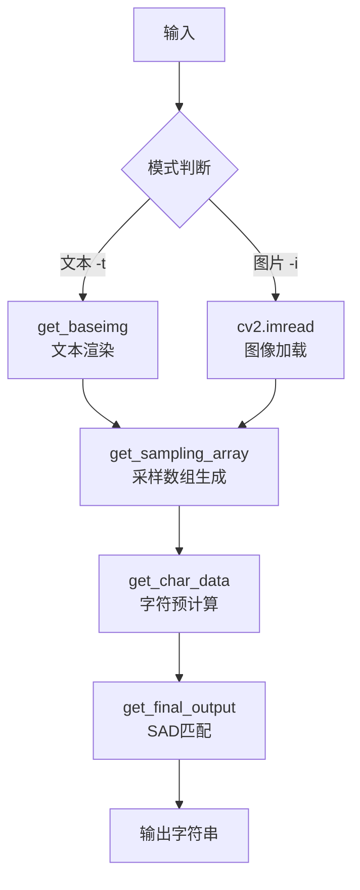

# 🏗️ 架构设计说明

本文档详细说明 UnicodeArt 的架构设计和模块职责。

---

## 📦 模块划分

### 核心模块

```
src/unicodeart/
├── console.py              # 控制流入口 (170行)
├── unicodeart_util.py      # 核心算法 (980行)
├── config/
│   ├── __init__.py         # 配置导出
│   └── constants.py        # 常量定义 (30行)
└── system_executor.py      # 系统执行器 (可选)
```

---

### 职责说明

#### 1. console.py - 控制流入口

**职责**:
- 解析命令行参数
- 验证输入有效性
- 协调处理流程
- 错误处理和日志输出

**关键函数**:
```python
def main():
    """主入口"""
    args = parse_arguments()
    validate_inputs(args)
    
    if args.image:
        process_image(args)
    elif args.text:
        process_text(args)
    
    output_result(result, args.output)
```

**设计原则**: 
- 薄控制层（仅流程控制）
- 无业务逻辑
- 易于测试

---

#### 2. unicodeart_util.py - 核心算法

**职责**:
- 图像预处理
- 采样数组生成
- 字符矩阵渲染
- 字符匹配（SAD算法）
- 输出组装

**核心函数**:

| 函数 | 行数 | 职责 |
|------|------|------|
| `get_baseimg()` | ~120 | 文本渲染为图像 |
| `get_sampling_array()` | ~80 | 图像分割与采样 |
| `get_char_data()` | ~100 | 字符矩阵预计算 |
| `get_final_output()` | ~60 | 匹配与输出组装 |
| `_render_char_to_matrix()` | ~40 | 单字符渲染 |
| `_decide_character_type()` | ~30 | 宽字符识别 |

**设计原则**:
- 函数拆分（10-20行子函数）
- 私有函数用 `_` 前缀
- 纯函数（无副作用）

---

#### 3. config/constants.py - 常量管理

**职责**:
- 集中管理所有魔法数字
- 提供合理默认值
- 文档化配置项

**示例**:
```python
DEFAULT_MATRIX_SIZE = 6  # 平衡质量和速度
DEFAULT_VERTICAL_HORIZONTAL_RATIO = 2.0  # 大多数字体高度≈2×宽度
DEFAULT_FONT_REDUCE = 0  # 字体大小不缩减
```

**优势**:
- 易于修改
- 避免硬编码
- 单一事实来源

---

## 🔄 数据流图

### 完整流程



---

### 详细数据流

#### 阶段 1: 输入处理

```
文本模式:
  text_string → preprocess_text_input() → lines[]
  lines[] + font → get_baseimg() → baseimg (PIL Image)

图片模式:
  image_path → cv2.imread() → baseimg (numpy array)
```

**关键点**:
- 文本模式需要字体渲染
- 图片模式直接加载
- 统一输出为灰度图像

---

#### 阶段 2: 采样数组生成

```
baseimg (H×W) 
  ↓ get_sampling_array(height, width, matrix_size)
sampling_array (R×C×M×M)
```

**计算过程**:
1. 计算输出尺寸: `R = height`, `C = width`
2. 计算块大小: `block_h = H/R`, `block_w = W/C`
3. 分割图像: 每个块 `block_h × block_w` 像素
4. 缩放归一化: 每个块缩放到 `M×M`，值域 [0,1]

**数据结构**:
```python
sampling_array[r][c] = normalized_MxM_matrix  # shape: (M, M)
```

---

#### 阶段 3: 字符预计算

```
charset (list of chars)
  ↓ get_char_data(font, matrix_size, ratio)
char_data[] = [
  {'char': 'A', 'matrix': MxM_array},
  {'char': 'B', 'matrix': MxM_array},
  ...
]
wide_char_data[] = [
  {'char': '中', 'matrix': 2MxM_array},  # 宽度翻倍
  ...
]
```

**优化**: 
- 缓存结果（避免重复渲染）
- 并行渲染（未来优化）

---

#### 阶段 4: 字符匹配

```
for each block in sampling_array:
  for each char in char_data + wide_char_data:
    score = SAD(block, char.matrix)
  best_char = argmin(score)
  output += best_char
```

**SAD 算法**:
```python
diff = np.abs(block - char_matrix)
score = np.sum(diff)
```

**复杂度**: O(R×C×N×M²)  
**瓶颈**: 这是最耗时的阶段（占 70-90% 时间）

---

#### 阶段 5: 输出组装

```
output_chars[] → join() → output_string
```

**宽字符处理**:
- 使用宽字符后，跳过下一个位置
- 保持视觉对齐

---

## 🎯 关键设计决策

### 决策 1: 为什么用 SAD 而非 SSD？

**选择**: Sum of Absolute Differences

**原因**:
1. **速度**: 无需平方运算，快 20-30%
2. **鲁棒性**: 对异常值不敏感
3. **效果**: 实验表明与 SSD 相当

**对比**:
```python
# SAD (当前)
score = np.sum(np.abs(block - char_matrix))

# SSD (备选)
score = np.sum((block - char_matrix) ** 2)
```

---

### 决策 2: 双字符集机制

**问题**: 中英文字符宽度不同

**方案**: 
- 维护两个字符集
- 宽字符矩阵宽度 = 2× 普通字符
- 匹配时根据得分权重选择

**实现**:
```python
if wide_score < wide_ratio * normal_score:
    use_wide_char()
else:
    use_normal_char()
```

**优势**: 自动识别，无需手动标注

---

### 决策 3: Line/Total 高度模式

**问题**: 用户需求多样

**方案**: 
- `line` 模式: 每行高度固定
- `total` 模式: 总高度固定

**技巧**: Line 模式转换为 Total 模式输入，复用核心逻辑

```python
if mode == 'line':
    total_height = height * num_lines + spacing
    # 复用 total 模式逻辑
```

**优势**: 避免代码重复

---

## 📊 性能特征

### 时间复杂度

| 阶段 | 复杂度 | 占比 |
|------|--------|------|
| 图像加载 | O(H×W) | <1% |
| 采样生成 | O(R×C×M²) | 5-10% |
| 字符预计算 | O(N×M²) | 5-10% |
| **字符匹配** | **O(R×C×N×M²)** | **70-90%** |
| 输出组装 | O(R×C) | <1% |

**主要瓶颈**: 字符匹配（嵌套循环）

**优化方向**:
- 早期终止（Early Termination）
- 候选过滤（基于均值/方差）
- 向量化加速（NumPy SIMD）
- 并行处理（多线程）

---

### 空间复杂度

| 数据结构 | 大小 | 峰值内存 |
|---------|------|---------|
| 原始图像 | H×W | ~1 MB |
| 采样数组 | R×C×M×M | ~10-50 MB |
| 字符缓存 | N×M×M | ~1-5 MB |
| **总计** | | **~50-200 MB** |

**优化方向**:
- 使用 float32 而非 float64（节省 50%）
- 流式处理（不缓存全部采样数组）

---

## 🔌 扩展点

### 如何添加新的匹配算法？

**步骤**:
1. 在 `unicodeart_util.py` 中添加新函数
2. 修改 `get_final_output()` 接受 `matching_algorithm` 参数
3. 添加命令行参数 `--matching-algo`

**示例**:
```python
def ssd_matching(block, char_matrix):
    """SSD 算法"""
    return np.sum((block - char_matrix) ** 2)

# 在 get_final_output 中
if algo == 'sad':
    score = np.sum(np.abs(block - char_matrix))
elif algo == 'ssd':
    score = ssd_matching(block, char_matrix)
```

---

### 如何支持彩色输出？

**挑战**: 
- 采样数组变为 `(R, C, M, M, 3)`
- 匹配算法需考虑 RGB 三通道

**方案**:
```python
# 扩展采样数组
sampling_array_rgb = np.zeros((R, C, M, M, 3))

# 颜色距离（欧氏距离）
def color_distance(rgb1, rgb2):
    return np.sqrt(np.sum((rgb1 - rgb2) ** 2))

# 匹配时比较颜色
score = color_distance(block_rgb, char_rgb)
```

**工作量**: 中等（需重构核心数据结构）

---

### 如何添加新的输出格式？

**当前**: 仅支持纯文本

**扩展**: ANSI、HTML、SVG

**方案**:
```python
def output_ansi(sampling_array, char_data):
    """ANSI 彩色输出"""
    for block in sampling_array:
        char, color = match_with_color(block, char_data)
        print(f"\033[{color}m{char}\033[0m", end='')

def output_html(sampling_array, char_data):
    """HTML 输出"""
    html = "<pre>"
    for block in sampling_array:
        char, color = match_with_color(block, char_data)
        html += f'<span style="color:{color}">{char}</span>'
    html += "</pre>"
    return html
```

---

## 📚 相关文档

- 📖 [API 参考](api-reference.md)
- 📝 [代码规范](coding-standards.md)
- 🚀 [扩展开发指南](extending.md)

---

*最后更新: 2026-06-09*
